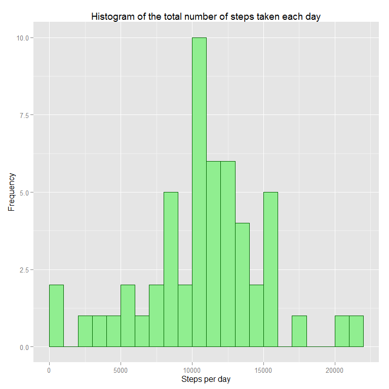
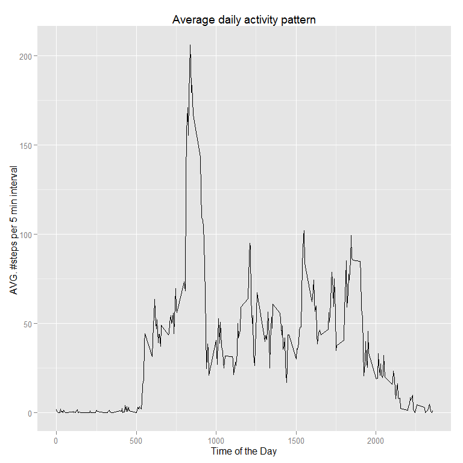
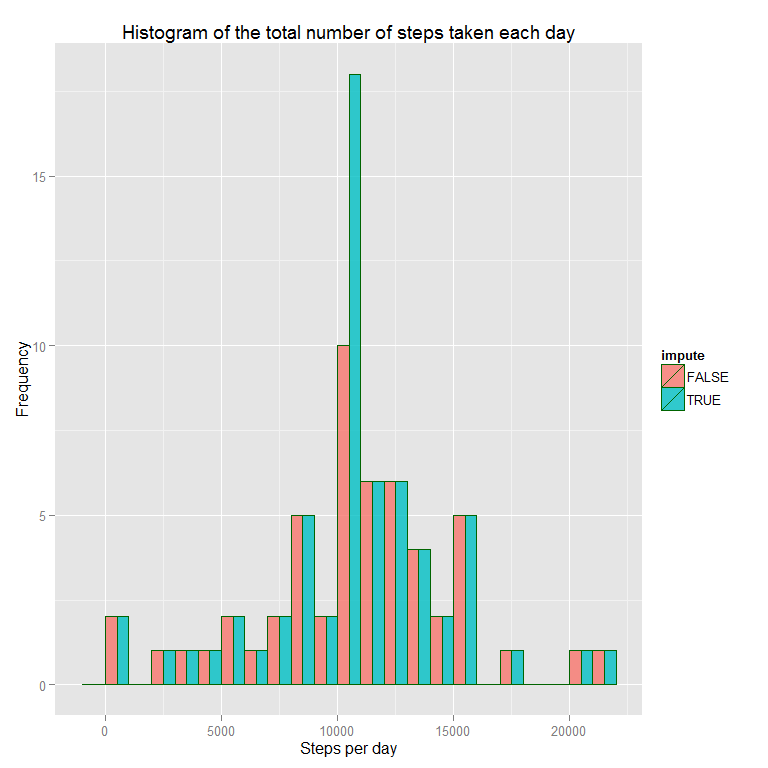
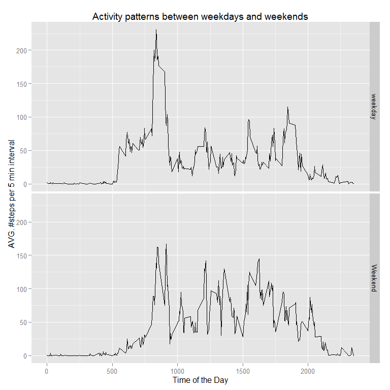

# Reproducible Research: Peer Assessment 1
  
 


##Intruduction

#### This submission is part of the Coursera *Reproducible Research: Peer Assessment 1* 

####  **DATA:** collected using personal activity monitoring device. This device collects data at 5 minute intervals through out the day. The data consists of two months of data from an anonymous individual collected during the months of October and November, 2012 and include the number of steps taken in 5 minute intervals each day.

* Dataset: [Activity monitoring data](https://d396qusza40orc.cloudfront.net/repdata%2Fdata%2Factivity.zip) [52K]


## Initializing
to run the code we need to use 'ggplot2', 'dplyr',  'lubridate' and 'stringr' packages.


```r
library("ggplot2")
library("dplyr")
library("lubridate")
library("stringr")
```


## Loading and preprocessing the data

To get the 'csv' file from the Zip file I use 'unz()' and then load the data using 'read.csv()'
The data is stored in a data frame 'mydata'
No further processing is needed.


```r
mydata <-  read.csv(unz("activity.zip", "activity.csv"),) 
```


## What is mean total number of steps taken per day?

To calculated the mean total number of steps taken each day I do the following

* Use 'filter()' function to remove 'NA's
* Groub the data by day to make it ready for summarise
* Summarise data by sum of steps per day


```r
day.data<-  mydata %>%
    filter(! is.na(steps))%>%
    group_by(date) %>%
    summarise(daysteps=sum(steps))
```

The total number of steps taken per day have mean of **10766.19** steps
and median of **10765.00** steps.


Here is the histogram of the total number of steps taken each day where x-axis is the number of steps per day and y-axis is the frequecy of that number of steps to observed.


```r
ggplot(day.data, aes(x=daysteps)) + 
    geom_histogram(color = "darkgreen", fill = "lightgreen", breaks = seq(0,22000,by=1000))+ 
    labs(list(title = "Histogram of the total number of steps taken each day",
              x = "Steps per day", y = "Frequency"))
```

 


## What is the average daily activity pattern?

To get the Average daily activity pattern  I do the following

* Use 'filter()' function to remove 'NA's
* Groub the data by interval to make it ready for summarise
* Summarise data by mean steps per per interval


```r
interval.data<-  
    mydata %>%
    filter(! is.na(steps))%>%
    group_by(interval)%>%
    summarise(suminterval=mean(steps))
```

below is a time series plot of the 5-minute interval (x-axis) and the average number of steps taken, averaged across all days (y-axis)


```r
ggplot(interval.data,aes(x=interval,y=suminterval))+geom_line()+
    labs(list(title = "Average daily activity pattern", x = "Time of the Day",
              y = "AVG. #steps per 5 min interval "))
```

 


The 5-minute interval, on average across all the days in the dataset, contains the maximum number of steps
**0835**
with **206.1698113** steps

## Imputing missing values

The total number of missing values in the dataset is *2304*

To remove the missing values I replace 'NA' with the mean for that 5-minute interval

calculated as follows.


```r
int.imp<-function(x)  (interval.data[match(x,interval.data$interval),]$suminterval)
```

I have created one data frame containing the original data and imputed data and
generated the histogram below


```r
imputedata <- mutate(mydata, steps =ifelse(is.na(steps),int.imp(interval ),steps ) )

imp.day.data<-  imputedata %>%
    group_by(date) %>%
    summarise(daysteps=sum(steps)) %>%mutate(impute=T)
con.data <- day.data %>%
    mutate(impute=F)%>% 
    rbind(imp.day.data)
```


This is the code for plotting the histogram


```r
ggplot(con.data, aes(x=daysteps,fill = impute)) + 
    geom_histogram(color = "darkgreen",alpha = 0.8, breaks = seq(-1000,22000,by=1000),
                   position="dodge")+
    labs(list(title = "Histogram of the total number of steps taken each day",
              x = "Steps per day", y = "Frequency"))
```

 


Them mean Total number of steps taken per day was 10766.19 and after imputing 'NA' it is
10766.19


Them Median Total number of steps taken per day was 10765.00 and after imputing 'NA' it is 10766.19

There is no change in the mean number of steps taked per day. since when we
we are adding steps equal to the mean of the intervals. thens is due to the fact that when there is NA it is For the whole day. while for the median did change since we increased the number of occurances of total number that is equal to the mean. 

## Are there differences in activity patterns between weekdays and weekends?

There is differences in activity patterns between weekdays and weekends as times series plot shows.


```r
imp.interval.data<-  
    imputedata %>%    
    mutate(Weekday = ifelse(wday(date) %in% c(1,7),"Weekend","weekday"))%>%
    group_by(interval,Weekday)%>%
    summarise(suminterval=mean(steps))
```
    
This is the code to plot the time series.
    

```r
ggplot(imp.interval.data,aes(x=interval,y=suminterval))+
    geom_line()+
    facet_grid(Weekday ~ .)+
    labs(list(title = "Activity patterns between weekdays and weekends",
              x = "Time of the Day", y = "AVG. #steps per 5 min interval "))
```

 
